# Schedule 日程与招募系统 PRD V2.1

## 当前阶段说明

- 本 PRD 当前阶段为：`P0 主链路 + 房间入桌、ready、开局检查与进行中加入审批风险识别版`。
- 当前仓库已经具备房间码加入、角色绑定、`join-info`、`ready_toggle`、普通 start、`force_start`、active 房间 `pending_approval`、Host approve/reject 后端等基础能力。
- 本轮重点不是公开招募平台，而是把“谁能进桌、什么时候能开局、active 补人如何审批、公开字段如何脱敏”这条链路收口。
- 当前识别到的主要工程缺口是：HostLobby 审批前端缺失、PlayerLobby 未区分 pending 审批态、`pending_approval` 的运行态权限未完全锁死、approve/reject 缺少审计口径、公开 DTO 还未显式成文化。
- 本轮不是生产完成版。私域招募、日程投票、提醒任务仍以后续确认后的批次为准。

## 背景

AI-Keeper 的核心链路需要一个稳定的会前调度层：房主能开团、玩家能加入、大家能 ready、房主能开局，进行中临时补人时不破坏桌面秩序。当前代码已经在 Room 和 Player Join 中实现了这条基础链路，但没有独立的招募帖、报名、排期、候补和提醒系统。

Schedule v1 的产品方向是先把“房间周边的组队和排期边界”定义清楚，再等 Room、User、Safety、Community 和 Ops 稳定后扩展为平台级招募系统。第一阶段不做公开招募广场，不做社区匹配，不做外部通知服务。

## 目标

1. 固化当前会前调度主链路：房间码加入、角色绑定、ready、大厅同步、开局检查。
2. 补齐进行中加入审批的前端可用性，让 `pending_approval` 不是只有后端测试存在。
3. 写硬 `pending_approval` 权限边界，避免玩家未获批准就拿到运行态权限。
4. 明确 `join_mode`、公开 DTO 白名单、`force_start` 和审批审计的产品口径。
5. 明确未来招募申请与当前角色入房的区别，避免报名阶段提前获得 `player_token`。
6. 明确日程投票与 ready 的区别，避免把现实时间协调写进游戏状态。
7. 给 DeepSeek 后续实现留出清晰的表、接口、测试和禁止事项。

## 非目标

- 不在本轮实现公开招募广场。
- 不实现玩家信誉、匹配推荐、活动运营。
- 不实现邮件、短信、移动推送等外部通知。
- 不让 Schedule 参与 AI 裁决、规则结算或世界状态写入。
- 不让招募页暴露剧本 `raw_text`、隐藏真相、结局、隐藏线索、隐藏 NPC。
- 不把 `characters.is_ready` 当作日程投票。
- 不把 `characters.status = pending_approval` 当作完整报名系统。

## 用户角色

| 角色 | 诉求 | 权限边界 |
| --- | --- | --- |
| Host | 开房、邀请玩家、查看 ready、审批进行中加入、未来发布招募和排期 | 只能管理自己房间或自己招募帖，不能看玩家账号隐私 |
| Player | 通过房间码入桌、绑定角色、ready、未来报名和提交可用时间 | 只能管理自己的报名、角色和可用时间 |
| Admin | 查看违规招募、处理平台治理问题 | 可下架公开招募，但 public 页面仍必须脱敏 |
| Future Observer | 未来旁观公开活动或招募 | 不进入 v1；不能进入玩家或 Host 权限 |
| DeepSeek 执行者 | 后续按批次补代码 | 必须先读当前 Room/User/Safety 代码和测试，不抢核心链路 |

## 范围

### v1 进入

- 保持现有房间码加入和 `join-info` 可用。
- 保持玩家登录后 `join-with-character`、账号角色恢复和 ready 可用。
- 保持 Host 普通 start 的 ready 检查和 `force_start` 显式绕过。
- 保持 active 房间加入写入 `pending_approval`。
- 补齐 Host 前端对 `pending_approval` 的展示、批准和拒绝。
- 写清 pending 玩家页、archive、运行态 intent、Projection 的权限边界。
- 建立公开 DTO 白名单和反剧透字段白名单。
- 写清未来 `RecruitPost`、`RecruitApplication`、`SchedulePoll` 的数据归属和不越权规则。

### v1 不进入

- 公开招募列表、搜索、筛选和推荐。
- 完整报名表、候补、房间容量、邀请码、白名单。
- 日历视图、循环排期、自动提醒。
- 出勤信誉、玩家评分、社区治理工作流。
- 外部日历、Webhook、邮件、短信、移动推送。

## 当前主链路

```mermaid
flowchart LR
  H["Host 创建房间"] --> J["玩家输入房间码"]
  J --> I["读取 RoomJoinInfoDTO"]
  I --> C["选择或创建角色"]
  C --> L["进入 Player Lobby"]
  L --> R["ready toggle"]
  R --> S["Host start"]
  S --> A["Room active"]
  A --> P["进行中新玩家加入"]
  P --> Q["pending_approval"]
  Q --> D["Host approve 或 reject"]
```



当前主链路中，Schedule 只负责会前和入桌协调。开局后的行动、AI、事务、状态、投影和日志仍由对应核心模块负责。

## Schedule 数据分层

| 层级 | 数据对象 | 说明 |
| --- | --- | --- |
| L0 `RoomPublicInfo` | 公开房间基础信息 | 给 join page 或未来招募页的公开字段 |
| L1 `RoomJoinInfo` | 入房前信息 | `join_mode`、公开剧本标题、公开摘要、人数等 |
| L2 `JoinAttempt` | 一次入房尝试 | 账号、房间、角色来源和限速上下文 |
| L3 `CharacterBinding` | 房间里的角色绑定 | 运行态角色与账号、房间的绑定关系 |
| L4 `LobbySnapshot` | 大厅快照 | 玩家、pending 玩家、ready、room status |
| L5 `ReadyState` | 当前是否准备开局 | 只表示这次 lobby 开局，不表示未来哪天有空 |
| L6 `StartGateDecision` | 普通开局检查结果 | 是否能 start、阻塞原因、未准备名单 |
| L7 `ForceStartDecision` | 强制开局决策 | `force_start`、actor、reason、confirm |
| L8 `PendingApprovalEntry` | 待审批成员 | active 房间新加入者的中间态 |
| L9 `HostApprovalDecision` | approve / reject | Host 管理操作，不是规则裁决 |
| L10 `RecruitPost` | 未来招募帖 | 只持有公开招募信息 |
| L11 `RecruitApplication` | 未来报名申请 | 批准前不入房、不发正式运行态权限 |
| L12 `SchedulePoll` | 未来日程投票 | 现实时间协调 |
| L13 `AvailabilityVote` | 未来时间可用性 | 只改自己的 vote |
| L14 `SessionSlot` | 未来已确认的一次场次 | 用于提醒、出勤、归档 |
| L15 `ReminderJob` | 未来提醒任务 | 依赖 Channel / Admin-Ops，不自建通知基础设施 |

关键边界：

- `RoomJoinInfo` 不等于成员权限。
- `CharacterBinding` 不等于 `RecruitApplication`。
- `ReadyState` 不等于 `SchedulePoll`。
- `PendingApprovalEntry` 不等于已进入运行态成员。
- `ReminderJob` 不得携带 token、私密备注、Safety feedback 或剧本真相。

## DTO / 审计契约

### 最小 DTO 集合

- `RoomPublicInfoDTO`
- `RoomJoinInfoDTO`
- `JoinModeDTO`
- `PlayerJoinRequestDTO`
- `PlayerJoinResultDTO`
- `LobbySnapshotDTO`
- `LobbyMemberDTO`
- `ReadyToggleResultDTO`
- `StartGateDecisionDTO`
- `ForceStartRequestDTO`
- `ForceStartResultDTO`
- `PendingApprovalDTO`
- `HostApprovalRequestDTO`
- `HostApprovalResultDTO`
- `PlayerPendingApprovalViewDTO`
- `RecruitPostPublicDTO`
- `RecruitApplicationDTO`
- `SchedulePollDTO`
- `AvailabilityVoteDTO`
- `SessionSlotDTO`
- `ScheduleApiErrorDTO`
- `HostApprovalAuditDTO`

### 关键 DTO 示例

```json
{
  "RoomJoinInfoDTO": {
    "roomId": "room_xxx",
    "roomStatus": "draft|lobby|active|paused|completed|archived",
    "joinMode": "direct|host_approval|closed",
    "scenarioTitle": "公开标题",
    "scenarioPublicSummary": "公开简介",
    "playerCount": 3,
    "capacity": null
  }
}
```

```json
{
  "PendingApprovalDTO": {
    "characterId": "char_xxx",
    "accountId": "acct_xxx",
    "playerName": "玩家昵称",
    "characterName": "调查员名",
    "status": "pending_approval",
    "requestedAt": "2026-07-08T00:00:00Z"
  }
}
```

```json
{
  "StartGateDecisionDTO": {
    "canStart": false,
    "reason": "not_ready_players",
    "notReadyCharacters": [
      {
        "characterId": "char_xxx",
        "displayName": "调查员名"
      }
    ]
  }
}
```

### 审计 DTO

```text
HostApprovalAuditDTO
- roomId
- targetCharacterId
- targetAccountId
- actorAccountId
- actorRole
- decision: approve|reject
- reason?
- previousStatus
- newStatus
- createdAt
```

## 公开 DTO 白名单

以下 DTO 必须只返回公开字段，不得直接回传底表原始对象：

- `RoomJoinInfoDTO`
- `RoomPublicInfoDTO`
- `RecruitPostPublicDTO`
- `LobbyPublicMemberDTO`

允许公开：

- 房间码或短链接
- 房间状态
- 剧本公开标题和公开简介
- 规则系统、推荐人数、预计时长、语言、时区
- Host 显示名
- 内容警示标签
- 已加入人数和容量

禁止公开：

- `owner_token`、`player_token`、账号 token
- `scenario` 原始对象
- `raw_text`、truth、ending、隐藏线索、隐藏 NPC、隐藏素材
- 角色 full profile
- 申请私信、玩家私密备注、Safety 会前边界反馈
- 本地路径、后台日志、AI prompt、AI call details

## 数据模型方向

### 当前已存在

| 表或字段 | 用途 | Schedule 解读 |
| --- | --- | --- |
| `rooms.room_id` | 房间码和房间主键 | 当前私域加入入口 |
| `rooms.scenario_id` | 绑定剧本 | 公开页只能展示公开标题和公开摘要 |
| `rooms.owner_token` | 房主管理凭证 | 不出现在任何公开 Schedule DTO |
| `rooms.owner_account_id` | 房主账号 | 用于房主找回房间和管理权限 |
| `rooms.status` | `draft/lobby/active/paused/completed/archived` | 决定 `join_mode` |
| `rooms.created_at` | 创建时间 | 可作为招募和后台排序基础 |
| `rooms.started_at` | 开始时间 | 不是计划开团时间，只是实际开局时间 |
| `characters.status` | `joined/pending_approval/left` 等 | 当前入房和进行中审批状态 |
| `characters.is_ready` | 玩家 ready | 只表示当前可开局，不表示未来可用时间 |
| `characters.account_id` | 角色归属账号 | 用于恢复 session 和防止冒领 |

### 未来新增

| 表 | 主要字段方向 | 说明 |
| --- | --- | --- |
| `recruit_posts` | `post_id`、`room_id`、`host_account_id`、`scenario_id`、`visibility`、`title`、`public_pitch`、`ruleset`、`max_players`、`status`、`created_at`、`closed_at` | 招募帖只引用公开信息，不复制剧本真相 |
| `recruit_applications` | `application_id`、`post_id`、`account_id`、`display_name`、`message`、`character_source_hint`、`status`、`created_at`、`reviewed_at` | 报名申请独立于角色运行态，批准后才入房 |
| `room_invites` | `invite_id`、`room_id`、`code_hash`、`expires_at`、`max_uses`、`used_count`、`created_by` | 私域邀请和可撤销链接 |
| `room_waitlist` | `waitlist_id`、`room_id`、`account_id`、`source_application_id`、`status`、`rank` | 候补不进入大厅 ready |
| `schedule_polls` | `poll_id`、`room_id`、`created_by`、`timezone`、`status`、`created_at` | 日程投票容器 |
| `availability_votes` | `vote_id`、`poll_id`、`account_id`、`slot_start`、`slot_end`、`availability`、`note` | 玩家现实时间可用性 |
| `session_slots` | `session_id`、`room_id`、`planned_start`、`planned_end`、`timezone`、`status` | 一次跑团的计划时间 |
| `attendance_records` | `record_id`、`session_id`、`account_id`、`status`、`reason_scope` | 出勤、请假、迟到、缺席记录 |
| `reminder_jobs` | `job_id`、`session_id`、`channel`、`scheduled_at`、`status` | 依赖 Ops 的后台任务 |

## `join_mode` 状态矩阵

| `rooms.status` | `join_mode` | 产品口径 |
| --- | --- | --- |
| `draft` | `direct` | 当前代码已允许加入；若未来改动必须整链同步 |
| `lobby` | `direct` | 可直接绑定角色入房 |
| `active` | `host_approval` | 加入后写 `pending_approval` |
| `paused` | `closed` | 当前版本固定为关闭态，不允许普通加入 |
| `completed` | `closed` | 不生成有效运行态加入 |
| `archived` | `closed` | 不生成有效运行态加入 |

补充规则：

- `join-info` 可以公开返回 `join_mode`。
- `join-info` 不授予权限。
- 实际入房必须登录并提交 `join-with-character`。

## `pending_approval` 权限边界

`pending_approval` 角色必须满足：

- 不计入 ready 统计和普通 start 检查。
- 不进入 active 主舞台。
- 不可提交运行态 intent。
- 不可移动地图。
- 不可查看 player archive。
- 不可接收 player-only 事件。
- P0 默认不进入 active `party` 队伍消息流；如需保留 waiting page 上的安全提示，必须在工程回执里明确范围。
- 可看到“等待 Host 审批”的安全页面。
- reject 后不得继续进入 active 主链路；是否立即失效 token 由工程回执写明。

这是 Schedule v1 的 P0 安全边界，不允许只靠前端隐藏来实现。

## `force_start` 规则与审计

`force_start` 是显式急救能力，不是普通 start 的默认路径。

产品规则：

- UI 不默认使用。
- 必须显式按钮触发。
- 必须先展示未 ready 玩家名单。
- 新前端请求应发送 `confirm=true + reason`。
- 必须记录 actor、roomId、notReadyCharacters、reason、createdAt。

当前代码现实：

- 后端已经对新 payload 要求 `reason + confirm`，并写 `s2c_force_start_audit`。
- 当前 `HostLobby` 仍发送旧的 `{ force_start: true }` legacy payload，V1 工程需要补齐。

## Host 审批规则与审计

approve / reject 属于房间管理操作，不是世界状态裁决。

产品规则：

- 仅 owner/admin 可以 approve / reject。
- 审批结果必须更新大厅快照。
- 审批动作必须写 `HostApprovalAuditDTO`。
- 审批记录进入 Journal / Admin 排查视图，但不进入 public export。
- 工程回执必须说明 reject 后 token 是否立即失效；若不失效，剩余可访问接口和页面范围是什么。

当前代码现实：

- approve / reject 后端已存在并会广播新的 `s2c_room_lobby_snapshot`。
- 当前尚未看到单独审批审计事件，需要在后续工程补齐。

## `RecruitApplication` 硬规则

未来报名申请在 `submitted / under_review` 阶段必须满足：

- 不创建正式运行态 `characters` 记录，或即使创建草稿记录也不得生成正式 `player_token`。
- 不进入 `LobbySnapshot`。
- 不进入 ready。
- 不接收 Room / Player WS。
- 不进入 Projection。
- 不进入 public export。

只有在：

`application approved -> character binding / join flow -> player_token`

之后，玩家才进入真正的房间运行态。

## 日程投票、出勤与提醒边界

### SchedulePoll / AvailabilityVote / AttendanceRecord

- 不修改 `characters.is_ready`。
- 不修改 `characters.status`。
- 不修改 HP / SAN / MP / Luck。
- 不修改 `room.status`。
- 不触发 AI 裁决。
- 只产生会前 / 会外协调事件和可审计记录。

### ReminderJob

- 不自建第三方通知密钥。
- 不硬编码邮件 / 短信 provider。
- 通知正文只含公开时间、房间公开名、必要链接。
- 不包含 player private note、Safety feedback、剧本真相、token。
- 通知失败不能阻断开局。

## 权限边界

| 行为 | Host | Player | Admin | 未登录 |
| --- | --- | --- | --- | --- |
| 查看公开 `join-info` | 可 | 可 | 可 | 可 |
| 通过房间码加入 lobby | 可作为玩家加入 | 可 | 可 | 需先登录才能绑定角色 |
| ready toggle | 不适用或仅玩家角色 | 仅自己的角色 | 不建议代操作 | 不可 |
| 普通 start | owner/admin | 不可 | 可 | 不可 |
| `force_start` | owner/admin 显式操作 | 不可 | 可 | 不可 |
| approve / reject pending | owner/admin | 不可 | 可 | 不可 |
| 发布招募帖 | 自己房间 | 不可 | 可代管或下架 | 不可 |
| 提交报名 | 可报名他人房间但不能自动入房 | 可 | 可 | 需登录 |
| 修改可用时间 | 自己的记录 | 自己的记录 | 可审计 | 不可 |
| 下架公开招募 | 自己帖子 | 不可 | 可 | 不可 |

## 接口方向

### 当前已存在

| 接口 | 用途 | Schedule 口径 |
| --- | --- | --- |
| `POST /api/rooms` | Host 创建房间 | 会前调度入口 |
| `GET /api/rooms/mine` | Host/Admin 找回自己的房间 | 后续招募帖可引用 |
| `GET /api/rooms/{room_id}` | 公开房间 DTO | 必须保持脱敏 |
| `POST /api/rooms/{room_id}/start` | 开局或 `force_start` | Schedule 到 Room active 的边界 |
| `GET /api/player/rooms/{room_id}/join-info` | 玩家加入前信息 | 公开字段安全关键接口 |
| `POST /api/player/rooms/{room_id}/join-with-character` | 玩家绑定角色入房 | 当前直接入房流程 |
| `POST /api/player/intent` with `ready_toggle` | 切换准备状态 | 当前 ready 状态来源 |
| `POST /api/host/{room_id}/approve/{character_id}` | 批准进行中加入 | 后端已有，前端需补 |
| `POST /api/host/{room_id}/reject/{character_id}` | 拒绝进行中加入 | 后端已有，前端需补 |

### 未来接口

| 接口 | 用途 | 约束 |
| --- | --- | --- |
| `POST /api/recruit/posts` | 创建招募帖 | 仅 host/admin，字段走公开白名单 |
| `GET /api/recruit/posts` | 公开招募列表 | 只返回公开、审核通过、未关闭帖子 |
| `GET /api/recruit/posts/{post_id}` | 招募详情 | 不返回申请私信和剧本真相 |
| `PATCH /api/recruit/posts/{post_id}` | 更新招募 | 仅 owner/admin |
| `POST /api/recruit/posts/{post_id}/applications` | 提交报名 | 登录账号，限速，不生成正式 `player_token` |
| `POST /api/recruit/applications/{application_id}/approve` | 批准报名 | owner/admin；批准后才进入 Room join / character 绑定 |
| `POST /api/recruit/applications/{application_id}/reject` | 拒绝报名 | 记录审核结果，不创建角色 |
| `POST /api/rooms/{room_id}/invites` | 创建邀请链接 | owner/admin，可设置过期和次数 |
| `POST /api/rooms/{room_id}/schedule-polls` | 创建日程投票 | owner/admin |
| `POST /api/schedule-polls/{poll_id}/votes` | 提交可用时间 | 房间成员或申请者，只改自己的 vote |
| `POST /api/session-slots/{session_id}/attendance` | 标记出勤状态 | 房间成员，只改自己的记录 |

## 与核心链路关系

- Room 决定房间生命周期；Schedule 只提供加入和排期前置条件。
- Character 决定角色卡结构；Schedule 不解析角色数值。
- User 决定账号、角色归属、Host/Admin 权限；Schedule 不单独实现身份系统。
- Projection 决定 pending / joined / public 的可见性投递；Schedule 只定义业务边界。
- Safety 决定公开字段、申请私信和会前边界反馈的可见范围。
- Channel 承载通知和聊天；Schedule 只产生需要通知的业务事件。
- Journal 记录开局、审批、改期、取消等可审计事件；Schedule 不写游戏内事件真相。
- AI-Keeper 不参与报名审批的最终决策，只能在未来提供可解释的辅助整理，不能自动拒绝或通过玩家。

## 验收标准

### v1 工程验收

- `join-info`、公开 room DTO 不返回凭证和剧本真相。
- 玩家加入 lobby 后 Host 和 Player 都能看到最新大厅快照。
- ready toggle 能影响普通 start 的通过条件。
- 未 ready 的有效成员阻止普通 start，返回可读的未准备名单。
- pending 玩家不阻塞普通 start。
- `force_start` 只能由 owner/admin 显式使用，新前端应发送 `confirm + reason`。
- `force_start` 记录审计事件。
- active 房间中新加入角色状态为 `pending_approval`。
- Host 前端能批准或拒绝 `pending_approval` 玩家。
- pending 玩家看到等待审批页，不自动进入 active 主舞台。
- pending 玩家不能提交运行态 intent、不能访问 player archive、不能收到 player-only 事件。
- pending 玩家默认不进入 active `party` 队伍消息流；若保留 waiting page 安全提示，必须有单独说明。
- 被拒绝玩家不能进入 active 主链路。
- reject 后 token 生命周期或残余能力必须在回执中说明。
- 账号恢复不能恢复他人角色。

### v1 文档验收

- Schedule 文档不宣称已有招募帖、报名表、日程投票和提醒。
- 未来接口与当前接口分区明确。
- `join_mode` 矩阵、公开字段白名单、pending 权限边界明确。
- DeepSeek 计划中每批都有测试命令和禁止事项。
- P0 / P1 / P2 边界明确，Schedule-4 / 5 进入工程前仍需用户再次确认。

### 后续平台验收

- 报名申请批准前不生成完整玩家运行态权限。
- 候补不进入 ready、lobby 成员和投影。
- 日程投票不改变世界状态。
- 改期、取消、审批都有 Journal 审计记录。
- 公开招募页经过 Safety 字段过滤和 Admin 下架机制。
