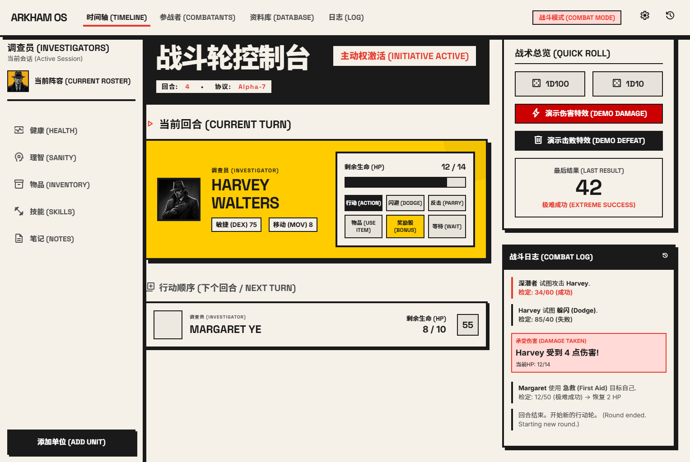
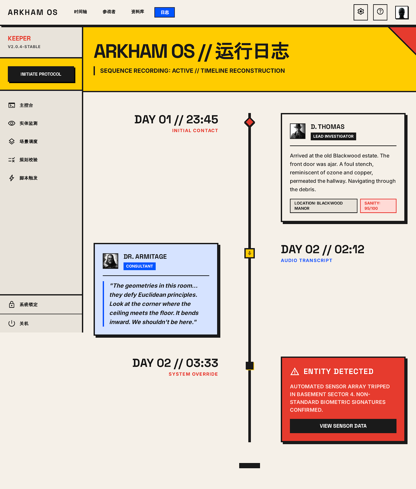
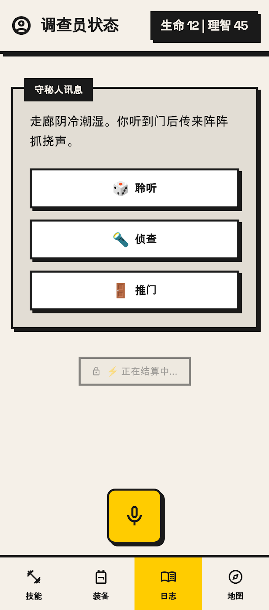
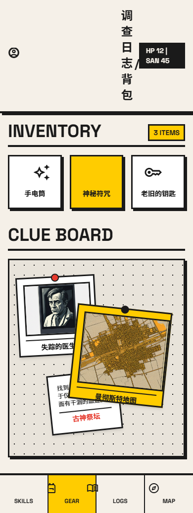
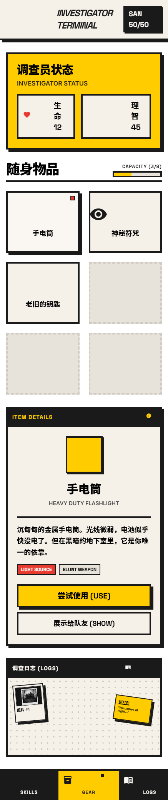

# 前端页面设计稿总览索引

> **目录**：`docs/40-前端设计/`
> **项目**：CodeX-aikeeper — 克苏鲁的呼唤（CoC）TRPG 跑团工具
> **设计风格**：Neo-Brutalist 新粗野主义（Bauhaus 规范）
> **页面形式**：Stitch 单文件自包含 HTML（内嵌 Tailwind CSS + Google Fonts + Material Symbols）
> **统计**：21 个 HTML 页面 · 5 份技术方案 MD · 1 份设计规范
> **整理状态**：✅ 已完成语义化重命名 + 去重（2026-06-27）+ 归档旧版（2026-07-12）

---

## 一、整体结构

```
40-前端设计/
│
├── INDEX.md                          ← 本文档
├── bauhaus/DESIGN.md                 ← 视觉设计规范（新粗野主义）
├── 哪些UI页面出来，分别给谁用.md       ← 顶层 UI 架构设计
├── 公共桌面/                          ← Shared Stage 产品规格 + 实时模式设计
│
├── 1_player_network_unicast_routing.md   ┐
├── 2_push_to_talk_stt_gateway.md         │  5 份玩家端 v2.0 技术方案
├── 3_living_sheet_touch_to_roll.md       │  （通信 / 语音 / 角色卡 / 背包 / 聊天）
├── 4_smart_inventory_clue_board.md       │
├── 5_tactical_chat_inline_buttons.md     ┘
│
├── host_dashboard_v3_insanity/  ~ host_logs/  ← 守密人端（Host/Keeper）保留最新版
├── player_status_v2/  ~ player_map_en/        ← 玩家端（Investigator）保留最新版
```

> **历史版本**：旧版迭代（v1/v2/static/dynamic 旧版）已归档至 `../90-归档/前端设计-旧版/`。整理前备份已删除（确认与主目录内容相同）。

---

## 二、设计规范

### `bauhaus/DESIGN.md` — 新粗野主义视觉规范

所有 21 个页面的统一视觉基础。核心理念 **"Form Follows Function"**。

| 维度 | 规范 |
|------|------|
| **主色** | 近黑 `#1a1a1a` · 高能黄 `#ffcc00` · 警示红 `#e63b2e` · 交互蓝 `#0055ff` · 暖白底 `#f5f0e8`（仿旧纸） |
| **字体** | Space Grotesk（标题，超大字号）+ Inter（正文） |
| **边框** | 无投影，用 2-3px 粗黑边 + 4-6px 偏移色块替代 |
| **布局** | 扁平纯色、不对称布局、每节黑+一强调色 |

---

## 三、技术方案文档（5 份）

根目录下 5 份 MD 描述的是**玩家端 v2.0 技术实现方案**，与玩家端 HTML 设计稿形成"设计稿 + 技术方案"的对应关系。

| 文档 | 主题 | 对应设计稿 |
|------|------|-----------|
| `1_player_network_unicast_routing.md` | 玩家通信网关与单播路由（REST 上行意图 + WebSocket 单播下行事件） | 全部玩家端页面 |
| `2_push_to_talk_stt_gateway.md` | 对讲机语音采集与 STT 网关（高敏触控对讲 + 语音转文字） | 战术聊天相关 |
| `3_living_sheet_touch_to_roll.md` | 活体角色卡与触控检定（技能意图提交 + 三态锁 + Watchdog 兜底） | `player_skills_*` 技能面板 |
| `4_smart_inventory_clue_board.md` | 智能背包与调查员软木板（线索确定性散列 + 详情 Modal） | `player_inventory_*` 背包装备 |
| `5_tactical_chat_inline_buttons.md` | 战术聊天终端与内联按钮（结构化 `s2c_tactical_prompt` + 战术按钮） | 战术聊天相关 |

---

## 四、守密人端页面（Host / Keeper）— 7 个

### 4.1 叙事仪表盘（核心主界面）— 3 个迭代版本

| 目录 | 版本 | 预览 | 功能说明 |
|------|------|------|---------|
| `host_dashboard_v1` | 基础版 |  | 中央叙事投影面板 + 右侧调查员监控卡片（ARTHUR HASTINGS / ELEANOR VANCE / DR. MASON）+ 全局骰子通知浮层 + 颗粒噪点叠加 + 移动端底部导航 |
| `host_dashboard_v2_lite` | 精简版 |  | 与 v1 同结构，移除骰子通知浮层，body 无 `relative`，体积更小。应为迭代/简化版本 |
| `host_dashboard_v3_insanity` | **疯狂特效版** ⭐ |  | 含 `insanity-mode` 故障特效：`text-glitch` 动画、RGB 分裂、故障色块层；顶部"模拟：临时疯狂"标识；DR. MASON 卡片带故障特效。**专为模拟角色陷入疯狂的视觉表现** |

> **版本关系**：v1 → v2_lite（精简）→ v3_insanity（加疯狂特效）。v3 具有特殊交互价值，建议保留为重点版本。

### 4.2 战斗追踪器 — 2 个版本

| 目录 | 版本 | 预览 | 功能说明 |
|------|------|------|---------|
| `host_combat_v1` | 标准版 |  | 战斗轮控制台：当前回合 / 行动队列 / 敌人卡 / 快速掷骰 / 战斗日志。无过渡动画 |
| `host_combat_v2` | **增强版** ⭐ |  | 同功能，新增 `transition-all` 过渡动画，布局更精细。当前回合大卡片（Harvey Walters，黄色主题）；深潜者敌人卡（红色主题） |

> **版本关系**：v1（早期）→ v2（增强动画版）。v2 为最终版本。

### 4.3 资料库

| 目录 | 预览 | 功能说明 |
|------|------|---------|
| `host_database` |  | **ARKHAM OS 资料库**。左侧档案列表（星之眷族/米斯卡托尼克大学/闪耀的偏方三八面体/修格斯）+ 右侧详情面板（形态描述/行为模式等克苏鲁神话生物资料）。中文内容 |

### 4.4 运行日志

| 目录 | 预览 | 功能说明 |
|------|------|---------|
| `host_logs` |  | **ARKHAM OS 运行日志**。时间线节点（关键事件/对话/系统事件）+ 调查员条目（D. Thomas / Dr. Armitage）+ "Entity Detected" 实体侦测事件 |

> ✅ **去重记录**：原 `host_logs_2` 与 `host_logs_1` 代码字节级完全相同且无截图，已于 2026-06-27 删除（备份保留）。

---

## 五、玩家端页面（Investigator）— 14 个

### 5.1 调查员状态/技能面板 — 4 个版本

| 目录 | 版本 | 预览 | 功能说明 |
|------|------|------|---------|
| `player_status_basic` | 基础版 |  | INVESTIGATOR STATUS，生命/理智状态。最简版本（9.3KB） |
| `player_skills_cn` | 中文技能专版 |  | INVESTIGATOR TERMINAL / 调查员状态。SAN 50/50、生命12、理智45；"核心技能 Core Skills"+"所有技能 All Skills"分区 |
| `player_status_v1` | 状态版 |  | 调查员状态，生命12\|理智45；底部导航含"技能/装备/地图"三个 tab |
| `player_status_v2` | 状态版（近似 v1） |  | 与 v1 高度相似，调查员状态 + 底部导航 |

### 5.2 技能动态面板 — 4 个版本（含 SAN 动画）

| 目录 | 版本 | 预览 | 功能说明 |
|------|------|------|---------|
| `player_skills_dynamic_v1` | **动态版（含SAN动画）** ⭐ |  | INVESTIGATOR_0824，核心技能/所有技能。含 JS 模拟 SAN 掉落动画（`Simulate SAN drop`），理智值动态变化 |
| `player_skills_dynamic_v2` | 动态版（v1 细微差异） |  | 与 v1 几乎一致（INVESTIGATOR_0824 + SAN drop 动画），细微差异版本 |
| `player_skills_static_v1` | 静态版 |  | 同 dynamic_v1 结构，HP:12/SAN:45 静态显示，无 SAN 动画脚本 |
| `player_skills_static_v2` | 静态版（近似 v1） |  | 与 static_v1 结构一致，静态显示，无动画 |

> **版本关系**：`dynamic_v1`/`dynamic_v2` 为含 SAN 动画的动态版（v1 为主版本）；`static_v1`/`static_v2` 为对应静态版。`dynamic_v1` 具有特殊交互价值。

### 5.3 背包 / 装备 / 线索板 — 2 个版本

| 目录 | 版本 | 预览 | 功能说明 |
|------|------|------|---------|
| `player_inventory_clue` | 背包+线索板组合 |  | 调查日志/背包。Inventory 物品区 + Clue Board 线索板 + 曼彻斯特地图 + 物品详情底部弹层（bottom-sheet） |
| `player_inventory_gear` | 随身物品专版 |  | INVESTIGATOR TERMINAL / 调查员状态 / 随身物品。含"调查日志 LOGS"区，物品交互 |

### 5.4 调查区域地图 — 4 个版本

| 目录 | 版本 | 预览 | 功能说明 |
|------|------|------|---------|
| `player_map_en` | 地图（英文标题） |  | Investigator Terminal - Map，调查区域地图，HP:12/SAN:45，底部导航"技能/装备/地图" |
| `player_map_cn` | 地图（中文标题） |  | 调查员终端 - 地图，调查区域地图，生命12/理智45。中文 title |
| `player_map_2b_v1` | 地图（⚠️ 截图与 map_en 相同） |  | Investigator Terminal - Map，病房 2B (WARD 2B) 区域。**截图与 `player_map_en` 字节级完全相同**，但代码不同 |
| `player_map_2b_v2` | 地图 |  | Investigator Terminal - Map，病房 2B 区域。与 v1 内容近似但截图不同 |

> **注意**：`player_map_en` 与 `player_map_2b_v1` 的 screen.png 完全相同（184,194 B），但 code.html 不同。需确认是否为截图误放；若为不同代码版本，建议重新生成 `player_map_2b_v1` 截图。

---

## 六、整理记录（2026-06-27 已执行）

### 已完成的操作

| 操作 | 涉及目录 | 状态 |
|------|---------|------|
| 删除冗余 | `host_logs_2`（与 host_logs_1 字节级相同，无截图） | ✅ 已删除（备份保留） |
| 语义化重命名 | 全部 `_1`~`_13` → `player_*` 语义化命名 | ✅ 已完成 |
| 版本号对齐 | `host_*` 加 `_vN` 后缀 | ✅ 已完成 |

### 待确认事项

| 类型 | 涉及目录 | 问题 | 建议 |
|------|---------|------|------|
| **截图重复** | `player_map_en` / `player_map_2b_v1` | screen.png 完全相同（184,194 B），但 code.html 不同 | 确认是否截图误放；若为不同代码版本，需重新生成 `player_map_2b_v1` 截图 |
| **近似重复** | `player_status_v1` / `player_status_v2` | 均为"调查员状态 + 底部导航"，高度相似 | 确认哪个为最终版，归档另一个 |
| **近似重复** | `player_skills_dynamic_v1` / `_v2` | 均为含 SAN 动画的技能动态面板，细微差异 | 以 v1 为主版本，v2 可归档 |
| **近似重复** | `player_skills_static_v1` / `_v2` | 均为静态技能面板，结构一致 | 以 v1 为主版本，v2 可归档 |

---

## 七、命名对照表（旧名 → 新名）

### 守密人端

| 旧名 | 新名 | 说明 |
|------|------|------|
| `host_1` | `host_dashboard_v1` | 叙事仪表盘基础版 |
| `host_2` | `host_dashboard_v2_lite` | 叙事仪表盘精简版 |
| `host_3` | `host_dashboard_v3_insanity` | 叙事仪表盘疯狂特效版 |
| `host_4` | `host_combat_v2` | 战斗追踪器增强版 |
| `host_combat_tracker` | `host_combat_v1` | 战斗追踪器标准版 |
| `host_database` | `host_database` | 资料库（保持） |
| `host_logs_1` | `host_logs` | 运行日志 |
| `host_logs_2` | ~~已删除~~ | 冗余副本（与 host_logs_1 相同） |

### 玩家端

| 旧名 | 新名 | 功能 |
|------|------|------|
| `investigator_terminal` | `player_status_basic` | 调查员状态基础版 |
| `_1` | `player_skills_cn` | 技能面板中文版 |
| `_2` | `player_status_v1` | 调查员状态 v1 |
| `_10` | `player_status_v2` | 调查员状态 v2 |
| `_4` | `player_skills_dynamic_v1` | 技能动态面板（含SAN动画）v1 |
| `_7` | `player_skills_dynamic_v2` | 技能动态面板（含SAN动画）v2 |
| `_5` | `player_skills_static_v1` | 技能静态面板 v1 |
| `_8` | `player_skills_static_v2` | 技能静态面板 v2 |
| `_3` | `player_inventory_clue` | 背包+线索板 |
| `_11` | `player_inventory_gear` | 随身物品装备 |
| `_6` | `player_map_en` | 调查区域地图（英文） |
| `_9` | `player_map_cn` | 调查区域地图（中文） |
| `_12` | `player_map_2b_v1` | 地图（病房2B）v1 |
| `_13` | `player_map_2b_v2` | 地图（病房2B）v2 |

---

## 八、功能模块速查矩阵

| 功能模块 | 守密人端 | 玩家端 | 技术方案 |
|----------|---------|--------|---------|
| 叙事/状态主界面 | `host_dashboard_v1` `v2_lite` `v3_insanity` | `player_status_basic` `player_skills_cn` `player_status_v1` `player_status_v2` | — |
| 技能检定 | — | `player_skills_dynamic_v1/v2` `player_skills_static_v1/v2` | `3_living_sheet_touch_to_roll.md` |
| 背包/装备/线索 | — | `player_inventory_clue` `player_inventory_gear` | `4_smart_inventory_clue_board.md` |
| 地图 | — | `player_map_en` `player_map_cn` `player_map_2b_v1` `player_map_2b_v2` | — |
| 战斗追踪 | `host_combat_v1` `host_combat_v2` | — | — |
| 资料库 | `host_database` | — | — |
| 运行日志 | `host_logs` | — | — |
| 通信/语音/聊天 | — | （设计稿待补） | `1_player_network_unicast_routing.md` `2_push_to_talk_stt_gateway.md` `5_tactical_chat_inline_buttons.md` |

---

## 九、技术实现备注

- **无独立 CSS/JS 文件**：全部 21 个页面均为单文件自包含，通过 CDN 引入 Tailwind CSS（含 forms、container-queries 插件）
- **Tailwind 配置**：每页内嵌 `<script id="tailwind-config">` 自定义 Neo-Brutalist 主题色板
- **字体**：Google Fonts — Space Grotesk（标题）+ Inter（正文）
- **图标**：Material Symbols Outlined（CDN）
- **特殊动画**：`host_dashboard_v3_insanity` 的 glitch 故障特效、`player_skills_dynamic_v1/v2` 的 SAN 掉落动画具有交互演示价值

---

## 十、归档说明

旧版迭代版本已归档至 `../90-归档/前端设计-旧版/`，包含：
- `host_combat_v1/`、`host_dashboard_v1/`、`host_dashboard_v2_lite/`
- `player_skills_cn/`、`player_skills_static_v1/`、`player_skills_static_v2/`、`player_skills_dynamic_v1/`
- `player_map_cn/`、`player_map_2b_v1/`、`player_map_2b_v2/`
- `player_status_basic/`、`player_status_v1/`

---

*本索引由 TechnicalArtist 整理 · 2026-06-27 完成语义化重命名与去重 · 2026-07-12 归档旧版*
