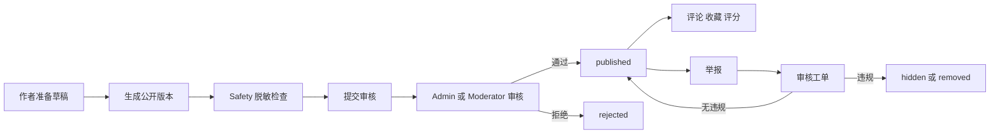
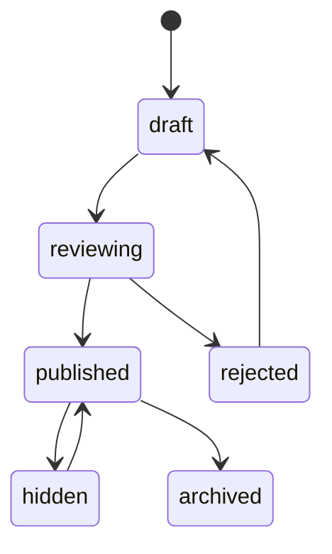
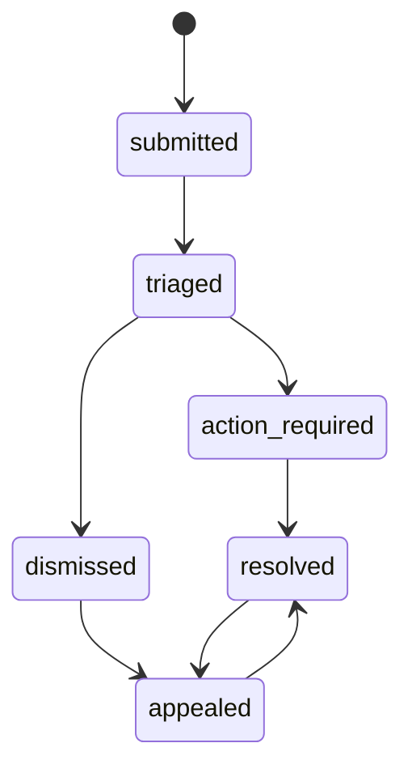

# Community 社区生态系统 PRD V2.0

## 背景

AI-Keeper 要从单房间跑团工具成长为平台，最终需要社区生态：玩家发现团，Host 发现模组，作者发布作品，房间成员分享战报，管理员处理举报和违规内容。但社区是高风险平台层，涉及剧透、版权、隐私、骚扰、刷分、审核和运营成本，不能抢在核心跑团链路和 Safety 过滤稳定之前上线。

当前仓库没有 Community 子系统。已有基础包括账号、Admin 后台、剧本导入、素材管理、质量报告、SpoilerGuard、public replay/export 和玩家 archive。这些只能作为社区的底层材料，不等于已经具备公开模组市场或招募广场。

## 目标

1. 定义 Community 的产品范围和不进入核心链路的边界。
2. 定义公开内容发布前的脱敏、审核、下架、恢复和审计口径。
3. 区分模组市场、招募广场、用户主页、评论评分、公开战报五类内容。
4. 明确未来社区数据模型不直接复用房间私密数据和剧本真相。
5. 给 DeepSeek 后续实现提供可执行的批次、测试命令和禁止事项。

## 非目标

- 不在本轮实现 `/api/community`。
- 不做公开模组市场页面。
- 不做招募广场页面。
- 不做评论、收藏、评分、关注、私信。
- 不做付费模组、创作者收益、版权结算。
- 不做 AI 自动审核、自动下架或自动封禁。
- 不让 Community 影响 AI 裁决、事务、状态、投影和日志主链路。

## 用户角色

| 角色 | 诉求 | 权限边界 |
| --- | --- | --- |
| Visitor | 浏览公开模组、公开招募、公开战报 | 只能看 published 且脱敏内容 |
| Player | 收藏模组、报名公开团、评论、评分、发布公开战报 | 只能管理自己的收藏、评论和显式发布内容 |
| Host | 发布招募、使用公开模组、发布房间战报 | 不能公开玩家私密内容和未脱敏剧本真相 |
| Author | 发布和维护模组版本 | 只能发布自己有权限的草稿和授权素材 |
| Moderator | 处理举报、隐藏评论、下架内容 | 未来角色；当前账号系统未实现 moderator |
| Admin | 全局审核、下架、恢复、封禁、查看审计 | 当前已有 admin 角色，但缺社区审核工作台 |
| AI-Keeper | 未来辅助标签、摘要和风险提示 | 不能自动决定公开、拒绝、封禁或删除 |

## 范围

### v1 进入

- 只做社区边界和数据模型设计。
- 固化发布安全白名单和禁止字段。
- 明确当前代码锚点与缺口。
- 设计审核状态机、举报状态机和发布对象状态机。
- 把 public replay/export 的社区化风险纳入 Safety 前置条件。

### v1 不进入

- 公开社区页面、列表、搜索、推荐。
- 社区数据库迁移和 API。
- 评论、收藏、评分、关注、举报实现。
- 付费、收益、活动运营、创作者认证。
- 对现有 Room、AI、State、Transaction、Projection 的行为修改。

## 产品分区

| 分区 | 主要对象 | 第一阶段口径 |
| --- | --- | --- |
| 模组市场 | `PublishedModule`、`ModuleVersion`、`ModuleAssetLicense` | 等 Module 和 Safety 稳定后做；发布对象必须脱敏 |
| 招募广场 | `PublicRecruitPost` | 依赖 Schedule；Community 只做公开发现，报名审批归 Schedule |
| 用户主页 | `PublicProfile`、`AuthorProfile` | 默认只展示公开昵称和显式公开内容 |
| 内容互动 | `Comment`、`Rating`、`Favorite` | 要求限速、删除、隐藏、举报和审核 |
| 战报分享 | `PublicBattleReport` | 来源是 Journal/export，但必须重新过滤和显式发布 |
| 社区治理 | `Report`、`ModerationCase`、`CommunityAudit` | Admin/Ops 支撑，所有处理留审计 |

## 当前数据基础

| 当前表或接口 | 可复用价值 | 不能直接做的事 |
| --- | --- | --- |
| `accounts` | 社区身份、作者归属、管理员权限 | 不能直接当公开主页，缺隐私设置 |
| `scenarios` | 模组草稿来源、标题、结构化数据、质量报告 | 不能直接公开 raw_text、knowledge_graph、original_file_path |
| `scenario_assets` | 模组素材来源 | 缺授权、可公开范围、封面标记 |
| `rooms` | 战报和招募可引用的房间来源 | 不能公开 owner token、房间私密状态 |
| `events` | 战报和 replay 来源 | 不能用粗过滤直接公开 |
| `campaign_archives` | 结局摘要和高光来源 | 可能含剧透，需要 owner 显式发布和过滤 |
| `spoiler_sensitive_items` | 发布前风险识别 | 只是索引，不等于完整审核 |
| `spoiler_audits` | 反剧透审计 | admin-only，不进社区公开页 |
| `/api/admin/accounts` | 管理账号和角色 | 不是社区用户管理后台 |
| `/api/admin/scenarios` | 管理剧本 | 不是公开模组列表 |
| `/api/rooms/{room_id}/export` | 导出战报 | public scope 当前仍需 Safety 加固 |
| `/api/rooms/{room_id}/replay` | Host 取 public replay | 只能作为发布前素材，不是公开分享链接 |

## 未来数据模型方向

| 表 | 主要字段方向 | 说明 |
| --- | --- | --- |
| `public_profiles` | `account_id`、`display_name`、`bio`、`avatar_asset_id`、`visibility`、`created_at`、`updated_at` | 与账号分离，默认最小公开 |
| `published_modules` | `published_module_id`、`source_scenario_id`、`author_account_id`、`title`、`public_summary`、`ruleset`、`status`、`current_version_id`、`created_at` | 不复制 raw truth，只存公开展示信息 |
| `module_versions` | `version_id`、`published_module_id`、`version`、`change_note`、`public_payload`、`safety_report`、`review_status` | 每版独立审核 |
| `module_asset_licenses` | `license_id`、`version_id`、`asset_id`、`license_type`、`public_use_allowed` | 公开素材必须有授权口径 |
| `community_posts` | `post_id`、`author_account_id`、`post_type`、`target_type`、`target_id`、`visibility`、`status`、`created_at` | 统一承载公告、心得、公开战报摘要 |
| `public_battle_reports` | `report_id`、`room_id`、`created_by`、`public_payload`、`visibility`、`status`、`created_at` | 显式发布的脱敏战报 |
| `comments` | `comment_id`、`target_type`、`target_id`、`author_account_id`、`body`、`status`、`created_at` | 支持 hidden、deleted、removed |
| `ratings` | `rating_id`、`target_type`、`target_id`、`account_id`、`score`、`created_at`、`updated_at` | 同一账号同一目标一条评分 |
| `favorites` | `favorite_id`、`target_type`、`target_id`、`account_id`、`created_at` | 默认私有 |
| `reports` | `report_id`、`target_type`、`target_id`、`reporter_account_id`、`reason_code`、`detail`、`status`、`created_at` | 举报人不公开 |
| `moderation_cases` | `case_id`、`source_report_id`、`target_type`、`target_id`、`assigned_admin_id`、`status`、`decision`、`created_at`、`resolved_at` | 审核工单 |
| `community_audits` | `audit_id`、`actor_account_id`、`action`、`target_type`、`target_id`、`before`、`after`、`created_at` | 管理操作留痕 |

## 权限边界

| 行为 | Visitor | Player/Host/Author | Moderator | Admin |
| --- | --- | --- | --- | --- |
| 浏览公开内容 | 可 | 可 | 可 | 可 |
| 创建公开主页 | 不可 | 仅自己 | 不代建 | 可代管异常 |
| 发布模组草稿 | 不可 | 仅有来源权限的作者 | 不可 | 可代管 |
| 提交审核 | 不可 | 仅作者 | 不可 | 可代管 |
| 发表评论 | 不可或需登录 | 可 | 可 | 可 |
| 删除自己评论 | 不可 | 可 | 可隐藏违规 | 可删除或恢复 |
| 收藏 | 不可或匿名本地 | 可 | 可 | 可 |
| 举报 | 可选登录策略 | 可 | 可 | 可 |
| 处理举报 | 不可 | 不可 | 可处理分配案件 | 可全局处理 |
| 下架内容 | 不可 | 作者可撤回自己内容 | 可按权限下架 | 可全局下架和恢复 |
| 查看审核内部备注 | 不可 | 不可 | 可看分配案件 | 可全量查看 |

## 公开发布流程

## 状态机

### 发布对象状态

### 举报状态

## 公开内容规则

### 模组公开页

可公开：

- 标题、公开简介、规则系统、推荐人数、预计时长、语言、标签。
- 内容警示和公开素材封面。
- 版本号、作者公开名、审核状态、更新时间。
- 质量报告中的非剧透摘要。

不可公开：

- `raw_text`、完整 `knowledge_graph`、truth、ending。
- 隐藏 NPC、隐藏线索、隐藏地图、隐藏素材。
- 原始 PDF 路径、RAG chunk、AI prompt、AI call logs。
- 未授权素材和本地文件路径。

### 公开战报

可公开：

- owner 或房间成员显式发布的公开叙事。
- party 公开事件中经过白名单允许的类型。
- 玩家显式同意展示的角色名和高光片段。

不可公开：

- host-only 事件。
- player-only 私密结果。
- 私密线索、个人目标、私密状态 patch。
- owner token、player token、account token。
- 未解锁真相和隐藏结局。

### 招募广场

可公开：

- Schedule 定义的招募标题、公开说明、人数、时间、规则系统、内容警示。
- Host 公开名和报名方式。

不可公开：

- 申请私信、候补内部排序、玩家联系方式、房间 token、剧本真相。

## 与其他模块关系

- User 提供账号、公开身份、隐私设置和角色权限。
- Module 提供模组编辑、版本草稿、结构化数据和公开发布源。
- Safety 提供脱敏、反剧透、visibility helper、举报内容安全边界。
- Schedule 提供招募和排期数据，Community 提供公开发现入口。
- Journal 提供 replay/export 原始材料，Community 只接收脱敏后显式发布版本。
- Asset 提供素材库和授权字段，Community 只展示允许公开的素材。
- Admin/Ops 提供审核、下架、恢复、封禁、审计和后台任务。
- AI-Keeper 只能辅助摘要、标签和风险提示，不能自动发布或封禁。

## 验收标准

### 文档阶段

- 明确当前没有 Community 实现。
- 所有社区能力都区分当前基础、P1 最小实现和长期能力。
- 模组、战报、招募的公开字段白名单和禁止字段明确。
- DeepSeek 计划不要求本轮实现社区页面和数据库迁移。

### 工程启动前

- Safety 的 public event/export 过滤已收口。
- Module 有公开版本和私密源数据的分离设计。
- Schedule 有招募公开字段和报名审批边界。
- Admin/Ops 有审核队列和审计设计。

### 工程实现后

- 未审核内容不出现在公开列表。
- 被下架内容公开不可见，作者和管理员可见状态和原因。
- 评论、评分、收藏都绑定账号并可限速。
- 举报能进入审核工单并留审计。
- 公开模组和公开战报不含 token、raw_text、truth、hidden clue、hidden NPC、本地路径、私密日志。
