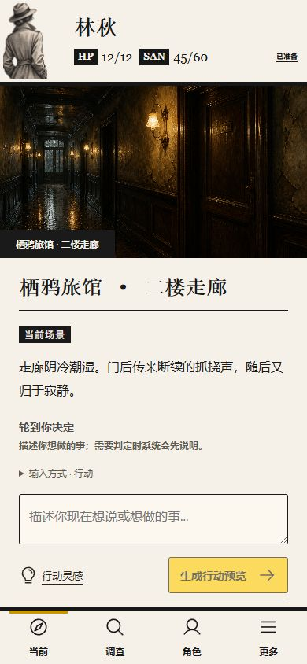

# GitHub 主线同步记录（2026-10-01）

本次将已提交的研发代码及已验证的玩家调查手记界面纳入主线。代码同步不代表 P0 发布验收通过。

## 合并范围

- 原 `main`：`4b22cbe7393dc1779c6fb14e15ae6c823b9708a1`。
- 研发分支：`codex/20260813-rag-corpus-audit`，起点 `4cdb1481d0437d66b855bd05efd1c12816e92e05`；包含 main 之后的 56 个提交。原来未推送的 6 个提交已上传，使用普通快进推送，未重写历史。
- 其他旧功能分支的提交已包含在上述历史中；`codex/2` 剩余独有提交经 `git cherry` 比较为等价补丁，不重复合并。
- 从原开发目录复制玩家调查手记的源码、依赖锁文件、两张装饰素材和测试；保留原目录的未提交改动。
- 修复 `ReviewPanelProps.runtime` 漏声明 `review_request_id` 的构建错误。
- 将 Owner 运行中终止入口的旧测试迁移到现有产品行为，同时保留不显示恢复操作和不跳过二次确认的断言。
- 修复发布校验器漏读后端全量、前端测试及前端构建退出码的问题；测试使用实际冻结要求 ID，不放宽生产门禁。

## 本次验证

| 验证 | 实际结果 | 范围 |
| --- | --- | --- |
| 前端全量 `npm test` | 60 文件、255 项通过，exit 0 | 当前合并候选源码，非真实多人验证 |
| 前端 `npm run build` | TypeScript 与 Vite 均通过，exit 0 | 保留 Vite 519.71 kB JavaScript 包体积警告 |
| 后端定向 | 78 项通过，exit 0 | 发布门禁、冻结 ID、歧义策略、证据转换、聚合器与 runner 合同 |
| 后端完整收集 | 1889 项成功收集，exit 0 | 仅收集，不等同全量执行通过 |
| 数据库主链定向 | 未完成 | `127.0.0.1:5432` PostgreSQL 连接超时；停止后续重复的 fixture 错误 |
| 差异格式 | `git diff --check` 通过 | 未提交运行产物 |
| 新浏览器/真实 Provider/正式 Benchmark | 未执行 | 不计为本次通过证据 |

后端定向命令：

```powershell
python -m pytest tests/server/test_ai_only_acceptance.py tests/server/test_ai_only_acceptance_A01.py tests/server/test_action_policy_A06.py tests/server/test_benchmark_evidence.py tests/server/test_benchmark_evidence_A07.py tests/server/test_ai_only_benchmark.py tests/server/test_ai_only_benchmark_A05.py tests/server/test_session_benchmark_runner.py -q
```

## 历史界面证据

下图来自 2026-09-06 玩家调查手记验收，使用真实 React 前端和模拟 API，不是本次重新执行的浏览器证据，也不证明真实 AI 或数据库闭环。



## 遗留项与保留材料

- 历史完整后端记录为 1825 passed / 41 failed；后续有定向修复，但本次没有新的完整执行通过结论。
- 原行动恢复重掷骰、自动复核正式调度到终态、开局探测重试、Owner 正常入口及复核失败恢复仍需独立复验。
- 正式 driver、固定模组 15 双人 + 15 四人、两条真实浏览器路径、故障矩阵和 123 条要求对账尚未形成整体通过证据。
- 本地原始验收 JSON、截图集合、Benchmark 草案、ZIP、临时脚本、运行日志及 AGENTS.md 的无关改动保留在原开发目录；本次不以这些材料的存在认定代码可发布。
