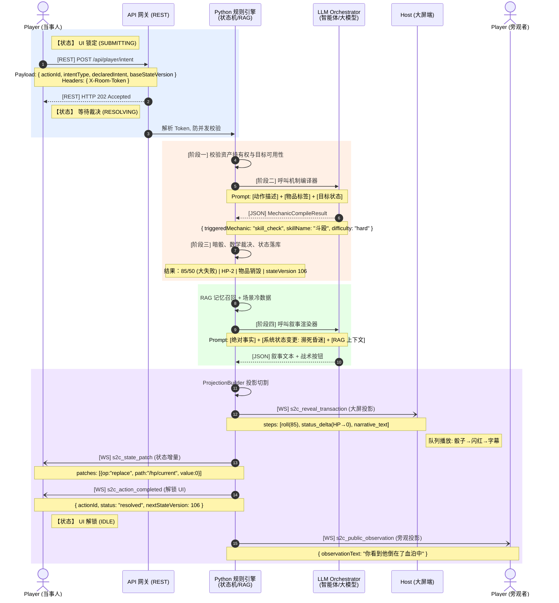

# PRD-29 - Engine 四阶段意图裁决管线与后验物品主张

**版本**: 1.0
**状态**: 待开发
**来源**: `数据流.md`、PRD-00、PRD-01、PRD-25
**定位**: Engine 侧从玩家意图到多端投影的完整裁决链路，以及基于角色背景的"后验物品主张"机制

## 1. 背景

PRD-01 定义了"意图提交 → Engine 结算 → 多端投影"的基本生命周期，但未展开 Engine 内部的裁决步骤。实际裁决需要经过四个独立阶段：Python 资产校验（零 Token 消耗）、LLM 机制编译（轻量模型做规则投射）、Python 规则引擎（数学暗骰 + 状态落库）、LLM 叙事渲染（结果包装）。任何一环试图越权都会破坏"Engine 是唯一权威写入者"的架构红线。

此外，TRPG 中玩家常基于角色背景提出"我口袋里应该有 X"的合理主张（如医生掏出手套）。系统不能简单拒绝（破坏沉浸感），也不能无条件放行（破坏平衡）。需要一套基于职业标签矩阵的自动化对账机制。

## 2. 目标

- 建立从 `POST /api/player/intent` 到多端投影的四阶段标准化裁决管线。
- 明确每个阶段的职责边界、输入输出和 Token 成本约束。
- 实现基于职业标签矩阵的"后验物品主张（Retroactive Item Claim）"自动对账。
- 确保任何阶段失败都有明确的降级/驳回路径，不产生僵尸状态。

## 3. 范围边界

**包含**
- 四阶段管线的阶段定义、输入/输出 Schema、异常处理。
- `retroactive_item_claim` 意图类型的完整生命周期。
- `scenario_assets.json` 的物品标签和职业矩阵数据结构。
- 后验主张的完胜/争议/违和三条分支判定逻辑。

**不包含**
- 具体 LLM 模型选型和供应商配置。
- 物品合成、装备系统、角色成长等二期规则。
- 前端 UI 的具体交互细节（由 PRD-09、PRD-10、PRD-14 覆盖）。

## 4. 用户故事

| ID | 用户故事 | 优先级 |
|---|---|---|
| US-29-1 | 作为 Engine 开发者，我需要每个意图经过固定的四阶段裁决，以便任何阶段的问题都能被精确定位。 | P0 |
| US-29-2 | 作为玩家，当我基于职业背景掏出合理物品时，系统应自动判定是否允许，而不是一律拒绝。 | P0 |
| US-29-3 | 作为系统，LLM 不能直接修改权威状态或生成未经校验的检定结果。 | P0 |
| US-29-4 | 作为剧本准备者，我需要为物品标注叙事标签和获取难度，以便系统自动匹配职业。 | P1 |

## 5. 功能需求

### 5.1 四阶段意图裁决管线

```
[POST /api/player/intent]
       │
       ▼
┌─────────────────────────────────┐
│ 阶段一：Python 资产校验层        │  零 Token 消耗
│ 校验持有权、目标存在性           │  失败 → HTTP 400/403
└──────────────┬──────────────────┘
               │ 通过
               ▼
┌─────────────────────────────────┐
│ 阶段二：LLM 机制编译器           │  轻量模型（如 GPT-4o-mini）
│ 将自然语言编译为标准检定 JSON    │  严禁生成叙事文本
│ 输出：MechanicCompileResult      │  失败 → 降级为 dialogue 意图
└──────────────┬──────────────────┘
               │
               ▼
┌─────────────────────────────────┐
│ 阶段三：Python 规则引擎绝对裁决  │  纯代码执行
│ 暗骰、状态落库、stateVersion++   │  大模型零参与
│ 输出：ResolutionResult           │
└──────────────┬──────────────────┘
               │
               ▼
┌─────────────────────────────────┐
│ 阶段四：LLM 叙事渲染器           │  主模型（如 GPT-4o / Claude）
│ 将数学事实包装为叙事文本         │  输出经 Engine 校验后投影
│ 输出：NarrativeProjection        │  失败 → 安全兜底文案
└─────────────────────────────────┘
```

**阶段一详细要求**：
1. 查询 `inventory` 确认物品 `itemId` 存在（若为 `use_item` / `show_item`）。
2. 若意图涉及场景实体，查询该实体在 `sceneId` 内是否活跃。
3. 校验失败立即返回 HTTP 400/403，不消耗任何 LLM Token。
4. `retroactive_item_claim` 意图跳过物品存在性校验（此时物品尚未在背包中）。

**阶段二详细要求**：
1. 使用轻量模型（如 GPT-4o-mini），通过 Function Calling 输出结构化 JSON。
2. 严禁生成叙事文本——此阶段只输出 `triggeredMechanic`、`skillName`、`difficulty`、`itemConsumed`、`consequence`。
3. 输出 Schema：
```json
{
  "triggeredMechanic": "skill_check" | "auto_success" | "auto_failure",
  "skillName": "斗殴",
  "difficulty": "regular" | "hard" | "extreme",
  "itemConsumed": false,
  "consequence": {
    "success": { "damage": "1d3", "effect": "窒息" },
    "failure": { "damage": "0", "effect": "激怒目标" }
  }
}
```
4. JSON 解析失败时，重试一次；仍失败则降级为 `dialogue` 意图（纯文本对话，无检定）。

**阶段三详细要求**：
1. 读取角色 `skillName` 数值，按 `difficulty` 计算成功门限。
2. `1d100` 伪随机数生成（服务器侧，客户端不可见）。
3. 若 `itemConsumed: true`，原子移除该物品。
4. 计算 HP/SAN/MP/Luck 变更，递增 `stateVersion`，写入审计日志。
5. 生成 `ResolutionResult` 供阶段四使用。

**阶段四详细要求**：
1. 接收 `ResolutionResult`（含掷骰数值、成败结果、状态变更）。
2. 主模型基于剧本氛围包装为叙事文本。
3. Engine 校验输出后通过 ProjectionBuilder 投影：
   - Host：封装为 `s2c_reveal_transaction`（含 roll、status_delta、narrative_text step）。
   - Actor Player：`s2c_state_patch` + `s2c_action_completed`。
   - Other Players：`s2c_public_observation`（若为公开行动）。
4. JSON 解析失败时使用安全兜底文案（不发送 AI 原始乱码），并记录 `ai_generation_error`。

### 5.2 后验物品主张（Retroactive Item Claim）

**意图类型**：`retroactive_item_claim`

**提交 Payload**：
```typescript
{
  actionId: string;
  intentType: 'retroactive_item_claim';
  baseStateVersion: number;
  declaredIntent: string;          // 玩家原始文本
  params: {
    claimedItemName: string;       // 主张物品名
    justificationText: string;     // 合理化理由
  };
}
```

**判定流程**（阶段一之后，合并到阶段二之前执行）：

Python Engine 基于 `scenario_assets.json` 中的 `professions_matrix` 计算"职业-物品契合度"：

| 分支 | 判定条件 | 处理 |
|------|---------|------|
| **完胜（Auto-Pass）** | 职业标签与物品叙事标签高度交织，且 `baselineAccess` 为 `common` 或 `common_professional` | 直接 `s2c_state_patch` 将物品 `add` 到背包（`source: "backstory"`），合流进入标准四阶段管线 |
| **争议（Roll Required）** | 职业与物品有关联但属管制/危险品 | 触发一次 Luck 或 Know 暗骰；通过则导入 + 扣幸运；失败则驳回（HTTP 409） |
| **违和（Refused）** | 职业与物品跨度荒谬 | 直接返回 HTTP 409，推送 Toast，零 Token 消耗 |

**完胜分支特殊处理**：
- 不进入阶段二（LLM 编译），直接由 Python 执行物品插入 + 状态递增。
- 不生成 Host 演出事务（"从口袋掏出手套"由后续使用手套的动作触发叙事）。
- 当事玩家收到 `s2c_state_patch` 和 `s2c_action_completed`。

### 5.3 静态剧本资产结构（`scenario_assets.json`）

```json
{
  "items": {
    "item_rubber_gloves_01": {
      "itemId": "item_rubber_gloves_01",
      "name": "医用塑胶手套",
      "physical": { "weight": 0.1, "isConcealable": true },
      "narrative": {
        "tags": ["医疗", "防护", "无害"],
        "baselineAccess": "common_professional",
        "description": "普通的丁腈橡胶手套，用以隔绝病菌与体液。"
      }
    }
  },
  "professionsMatrix": {
    "doctor": {
      "tags": ["医疗", "高知", "救助"],
      "allowedAccessLevels": ["common", "common_professional"]
    },
    "thief": {
      "tags": ["潜行", "非法", "犯罪"],
      "allowedAccessLevels": ["common", "underground_tools"]
    }
  }
}
```

**字段说明**：
- `baselineAccess`：物品获取难度——`common`（人人可及）、`common_professional`（职业常识物）、`restricted`（管制物，需检定）、`unique`（唯一剧情物品，不可主张）。
- `allowedAccessLevels`：该职业可主张的物品级别上限。`unique` 级别物品不能通过后验主张获得。

## 6. 接口/事件依赖

| 类型 | 名称 | 用途 |
|------|------|------|
| REST | `POST /api/player/intent` | 所有意图类型统一入口 |
| Intent | `retroactive_item_claim` | 后验物品主张 |
| Intent | `skill_check` / `use_item` / `show_item` / `dialogue` | 标准意图 |
| Event | `s2c_reveal_transaction` | Host 公共演出投影 |
| Event | `s2c_state_patch` | Player 增量状态同步（含物品 add） |
| Event | `s2c_action_completed` | 动作解锁 |
| Event | `s2c_public_observation` | 旁观玩家模糊观察 |
| Type | `MechanicCompileResult` | 阶段二输出 Schema |
| Type | `ResolutionResult` | 阶段三输出 Schema |
| Type | `ScenarioAssets` | 剧本物品与职业矩阵 |
| Type | `ProfessionMatrix` | 职业标签 + 获取权限 |

## 7. 状态与错误处理

- 阶段一校验失败：HTTP 400/403，UI 解锁，零 Token 消耗。
- 阶段二 JSON 解析失败：重试一次 → 仍失败则降级为 `dialogue` 意图，不走检定管线。
- 阶段三不可恢复错误（如角色不存在）：返回 HTTP 500，记录 `engine_critical_error`，不发送任何投影事件。
- 阶段四 AI 失败：使用安全兜底文案（"守秘人的声音短暂地被杂音吞没…"），记录 `ai_generation_error`，正常发送 `s2c_action_completed`。
- 后验主张违和分支：HTTP 409，不消耗 Token。
- 争议分支暗骰失败：HTTP 409，物品不导入，幸运值不扣除。
- `unique` 级别物品的后验主张直接返回 HTTP 403（不可主张）。
- 连续多次后验主张触发冷却（同一角色每分钟最多 2 次）。

## 8. 验收标准

- 一个标准 `skill_check` 意图经四阶段管线完成从提交到 Host 骰子演出 + Player 状态同步的闭环。
- 阶段二 JSON 解析失败时自动降级为 `dialogue`，不阻塞管线。
- 医生角色主张"医用塑胶手套" → 完胜分支 → 物品直接入包。
- 医生角色主张"锋利手术刀" → 争议分支 → 触发 Luck 暗骰。
- 流浪汉角色主张"无菌注射器" → 违和分支 → HTTP 409。
- `unique` 级别物品主张 → HTTP 403。
- 所有阶段失败都有明确的 HTTP 状态码和 UI 恢复路径。

## 9. 测试场景

1. 玩家提交 `skill_check` 意图，阶段一校验通过，阶段二编译为 `{ triggeredMechanic: "skill_check", skillName: "侦查" }`，阶段三生成暗骰 45（成功），阶段四生成叙事文本 → Host 播放事务。
2. 阶段二返回非法 JSON，系统重试一次后降级为 `dialogue` → UI 解锁，玩家可重新提交。
3. 医生玩家提交 `retroactive_item_claim` 主张"听诊器" → `professionsMatrix` 匹配 `common_professional` → 完胜 → 物品入包，`source: "backstory"`。
4. 医生玩家主张"手术刀" → `restricted` 级别 → 争议分支 → Luck 暗骰失败 → HTTP 409。
5. 同一角色 1 分钟内提交第 3 次后验主张 → HTTP 429（冷却）。

## 10. 风险依赖

- 依赖 `scenario_assets.json` 在 PDF 导入阶段（PRD-22）正确生成物品标签和职业矩阵。若剧本包缺失此文件，所有后验主张走争议分支（需暗骰），不可走完胜。
- 阶段二的轻量模型需要稳定的 Function Calling 能力；若模型不支持，可降级为基于规则关键词的纯 Python 编译器。
- 后验主张的冷却和频率限制需与 PRD-25 的批次结算窗口协调——冷却应在批次内累积计数。
- 职业标签匹配的莱文斯坦编辑距离阈值需可配置，避免过于宽松或严苛。

## 11. 已知架构边界 Bug 与防御方案

以下 4 个 Bug 来源于对"四阶段管线 + 多端异步投影"系统的极限压力推演。它们不是业务逻辑错误，而是**分布式状态机在时间轴上发生扭曲**的必然产物，需要在核心代码编写时预先打上补丁。

### Bug 1：规则引擎与 LLM 之间的"事实时差 (Fact Lag)"

**场景**：
1. 玩家 HP=1，试图跳窗逃跑。
2. 阶段三暗骰失败 → HP -2 → 内存中 HP=-1（濒死/昏迷）。
3. 阶段四 LLM 只收到"检定失败，扣 2 HP"。
4. LLM 生成的叙事是"你咬着牙站起来继续跑"——但玩家在系统里已经昏迷。

**防御方案**：阶段三向阶段四传递的上下文中，必须追加 `[系统状态变更]` 强制提示块，明确列出级联后果（如 `"HP 归零，进入昏迷状态，失去行动能力"`）。Prompt 模板：

```
[绝对事实] 斗殴检定大失败，扣除 2 HP。
[系统状态变更] 玩家当前 HP 归零 (0/10)，已进入"昏迷"状态，丧失自主行动能力。叙事必须以玩家失去意识作为结尾。
```

**影响范围**：Engine 阶段三 → 阶段四的 Prompt 组装逻辑。

### Bug 2："私密获取"与"大屏公开演出"的时序穿透 (Spoiler Leak)

**场景**：
1. 玩家 A 撬开保险箱（公开检定）。
2. Engine 同时下发 Host `s2c_reveal_transaction`（含 6 秒骰子动画）和 Player `s2c_state_patch`（瞬间入包手枪）。
3. 大屏骰子还在滚，手机已弹出"获得手枪"——玩家喊出声，全场剧透。

**防御方案**：含私密结果的 `s2c_state_patch` 和 `s2c_action_completed` 必须等待 Host 事务到达特定 step 后才下发。

具体实现二选一：
- **方案 A**：`s2c_state_patch` 携带 `executeAfterStep: number` 字段，Player 路由器收到后延迟应用，直到对应的 `s2c_reveal_transaction` 广播到达该 step 索引。
- **方案 B（MVP 推荐）**：Engine 在事务的 `status_delta` step 广播后才向 Player 发送 Patch——利用广播本身就是天然的时序信号。

**影响范围**：Engine ProjectionBuilder 的下发时序、Player Router 的 Patch 延迟应用逻辑。

### Bug 3：断线重连时的"幽灵补丁 (Ghost Patch)"

**场景**：
1. 玩家手机断网 5 秒，期间 Engine 下发毒气伤害 `s2c_state_patch`（`baseVersion=105 → 106`）。
2. 手机重连，因序列号落后主动请求 `GET /api/player/sync`。
3. 全量快照在 HTTP 传输中，WebSocket 同时重传了 Patch。
4. 前端先应用 Patch（基于旧版本），再被 Snapshot 全量覆盖 → 版本号不可逆错乱。

**防御方案**：Player 端引入 **State Version Barrier（状态版本屏障）**——

1. 收到 `s2c_state_patch` 时，检查 `baseStateVersion`：
   - 若 `base === currentVersion`：正常应用，递增 `currentVersion`。
   - 若 `base > currentVersion`（出现断层）：将 Patch 压入 `pendingPatches` 缓冲区。
2. 断层出现时，立即拉取 `GET /api/player/sync`。
3. 全量快照到达并应用后，丢弃所有 `baseStateVersion <= snapshot.stateVersion` 的缓存 Patch。
4. 若仍有 `baseStateVersion > snapshot.stateVersion` 的 Patch，按序应用。

**影响范围**：Player Store 的 `applyStatePatch` 方法、`/api/player/sync` 的调用逻辑。

### Bug 4：Urgent 抢占时的"BGM 幽灵音 (Audio Ducking Failure)"

**场景**：
1. Host 播放舒缓探险 BGM。
2. 即死陷阱触发，Engine 下发 `priority: 'urgent'` 事务。
3. 屏幕切红、尖叫 SFX 播放——但 BGM 仍在悠然长笛。
4. 因为 `useAudioController` 只监听 `bgm.trackId` 变化，未处理紧急静音。

**防御方案**：
1. `s2c_reveal_transaction` 的 `priority: 'urgent'` 事务中，payload 增加音频调度字段：
   ```typescript
   { priority: 'urgent', audioAction: 'suspendBGM' | 'duckBGM' }
   ```
2. `EventRouter` 处理 Urgent 事务时，强制调用 `AudioMixer.getInstance().fadeBGM(0, 500)`。
3. Urgent 事务结束后，Engine 下发恢复指令或 Host 恢复默认 BGM 状态。

**影响范围**：Host EventRouter 抢占逻辑、AudioMixer、PRD-05 氛围引擎。

## 12. 附录 A：全局数据流序列图

以下 Mermaid 图覆盖从玩家开口说话到大屏演出、手机扣血的全生命周期。可在 [mermaid.live](https://mermaid.live/) 渲染。



## 13. 附录 B：核心数据结构速查

### 统一上行接口

**`POST /api/player/intent`** — 一切玩家行为的网关。

| 字段 | 类型 | 说明 |
|------|------|------|
| `actionId` | string (UUID) | 幂等去重 |
| `intentType` | string | `skill_check` / `use_item` / `show_item` / `dialogue` / `voice_command` / `retroactive_item_claim` / `ready_toggle` / `share_clue` / `clarification_request` |
| `declaredIntent` | string | 自然语言描述 |
| `baseStateVersion` | number | 防脏读连点 |
| `params` | object | 动态参数（`itemId`、`skillName` 等） |

**Request Headers**: `X-Room-Token`（认证与身份解析）。

### 统一下行信封

所有 Engine → Client 推送包裹在 `EngineEvent<T>` 中（完整定义见 PRD-00 §2）。

### 核心 Payload 速查

| Payload | 用途 | 关键字段 |
|---------|------|---------|
| `StatePatchPayload` | Player 增量状态 | `baseStateVersion`, `nextStateVersion`, `patches[]`（RFC 6902） |
| `RevealTransactionPayload` | Host 公共演出 | `transactionId`, `priority`, `steps[]`（roll→status_delta→scene_transition→narrative_text） |
| `ActionCompletedPayload` | Player UI 解锁 | `actionId`, `status`（resolved/rejected/expired/cancelled/timeout）, `nextStateVersion` |
| `MechanicCompileResult` | 阶段二 LLM 输出 | `triggeredMechanic`, `skillName`, `difficulty`, `itemConsumed`, `consequence` |
| `ResolutionResult` | 阶段三 Engine 输出 | `roll`, `target`, `resultType`, `effects[]`, `cascadingStateChanges[]` |
