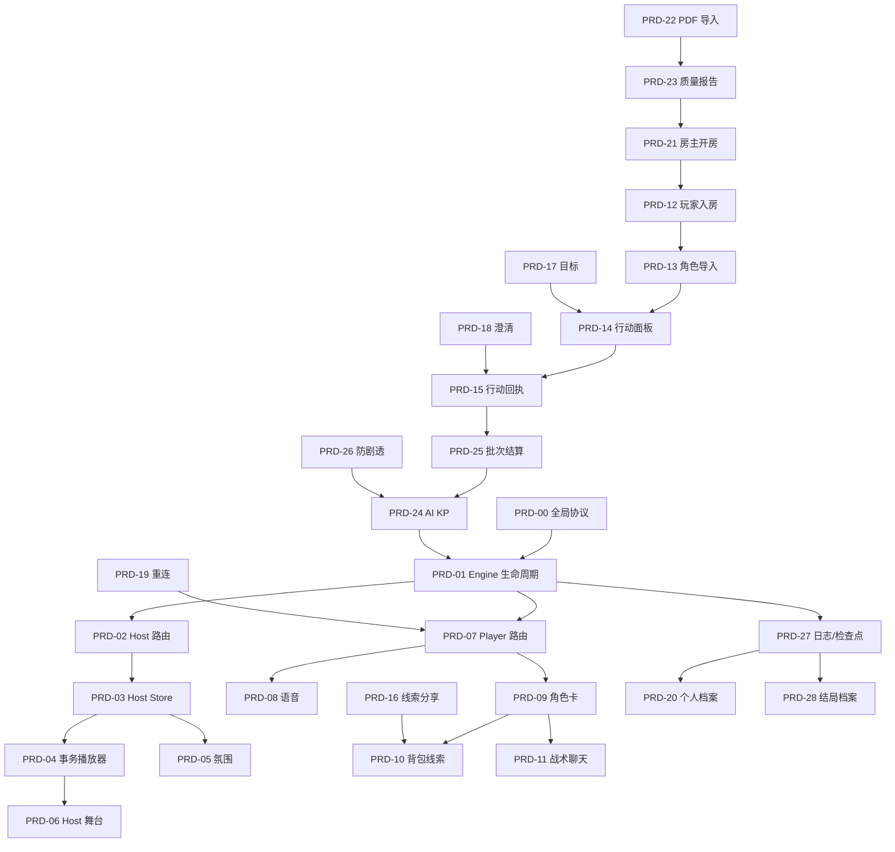

# AI-Keeper 最终版本 PRD 索引

**版本**: 2.0  
**状态**: 待开发  
**定位**: AI 自动 KP + Host 公共舞台 + 手机玩家端 + PDF 剧本自动导入。  
**原则**: Engine 写权威状态，AI KP 自动主持，Host 展示共同现实，Player 手机承载个人行动和私密信息。

## 1. 产品定位

本目录将最终版本拆成两层 PRD：

- **模块 PRD（00-11）**：定义协议、Engine 边界、Host 演出、Player 基础模块。
- **工作流 PRD（12-28）**：定义 AI 自动 KP 产品下，玩家、房主、剧本准备者从开局到复盘的完整旅程。

首版核心假设：

- AI 是 KP，人类房主只负责开房、邀请、暂停、重试和有限急救。
- 房主可以作为玩家参与，因此不能拥有完整 KP 剧透视角。
- 玩家端手机竖屏优先，公共信息看 Host 大屏。
- 玩家输入语音优先，文字和战术按钮补充。
- 剧本准备以文字 PDF 导入为起点，系统自动结构化并给质量报告。
- 私密线索默认只给本人，玩家主动分享后才进入团队视角。

## 2. 推荐阅读顺序

### 2.1 基础契约

1. [PRD-00 - 全局协议与投影契约](./PRD-00-全局协议与投影契约.md)
2. [PRD-01 - Engine 意图生命周期与状态写入边界](./PRD-01-Engine意图生命周期与状态写入边界.md)

### 2.2 玩家手机旅程

3. [PRD-12 - 玩家加入房间与手机准备流程](./PRD-12-玩家加入房间与手机准备流程.md)
4. [PRD-13 - 玩家角色卡导入与剧本适配反馈](./PRD-13-玩家角色卡导入与剧本适配反馈.md)
5. [PRD-14 - 玩家行动面板与语音优先输入](./PRD-14-玩家行动面板与语音优先输入.md)
6. [PRD-15 - 玩家行动回执与 AI 归并反馈](./PRD-15-玩家行动回执与AI归并反馈.md)
7. [PRD-16 - 玩家私密线索与主动分享](./PRD-16-玩家私密线索与主动分享.md)
8. [PRD-17 - 玩家个人目标与当前任务](./PRD-17-玩家个人目标与当前任务.md)
9. [PRD-18 - 玩家澄清请求与误判纠正](./PRD-18-玩家澄清请求与误判纠正.md)
10. [PRD-19 - 玩家断线重连与状态恢复](./PRD-19-玩家断线重连与状态恢复.md)
11. [PRD-20 - 玩家个人档案与自由复盘查询](./PRD-20-玩家个人档案与自由复盘查询.md)

### 2.3 房主与剧本准备旅程

12. [PRD-21 - 房主开房与有限急救权限](./PRD-21-房主开房与有限急救权限.md)
13. [PRD-22 - PDF 剧本导入与自动结构化](./PRD-22-PDF剧本导入与自动结构化.md)
14. [PRD-23 - 剧本质量报告与一键开局](./PRD-23-剧本质量报告与一键开局.md)

### 2.4 AI KP 主持链路

15. [PRD-24 - AI 自动 KP 主持循环](./PRD-24-AI自动KP主持循环.md)
16. [PRD-25 - 自由行动收集与批次结算](./PRD-25-自由行动收集与批次结算.md)
17. [PRD-26 - 防剧透策略与暴露度控制](./PRD-26-防剧透策略与暴露度控制.md)
18. [PRD-27 - 事件日志存档回放与检查点](./PRD-27-事件日志存档回放与检查点.md)
19. [PRD-28 - 自动结局与可查询战役档案](./PRD-28-自动结局与可查询战役档案.md)

### 2.5 Host/Player 运行时模块

20. [PRD-02 - Host 通信总线与路由分发](./PRD-02-Host通信总线与路由分发.md)
21. [PRD-03 - Host 全局 HUD 与状态聚合](./PRD-03-Host全局HUD与状态聚合.md)
22. [PRD-04 - Host 事务播放器与多级队列](./PRD-04-Host事务播放器与多级队列.md)
23. [PRD-05 - Host 氛围引擎](./PRD-05-Host氛围引擎.md)
24. [PRD-06 - Host 舞台演出与剧情渲染](./PRD-06-Host舞台演出与剧情渲染.md)
25. [PRD-07 - Player 通信网关与单播路由](./PRD-07-Player通信网关与单播路由.md)
26. [PRD-08 - Player 对讲机与语音意图](./PRD-08-Player对讲机与语音意图.md)
27. [PRD-09 - Player 活体角色卡与触控检定](./PRD-09-Player活体角色卡与触控检定.md)
28. [PRD-10 - Player 背包与线索软木板](./PRD-10-Player背包与线索软木板.md)
29. [PRD-11 - Player 战术聊天与结构化行动按钮](./PRD-11-Player战术聊天与结构化行动按钮.md)

## 3. 角色旅程矩阵

| 角色 | 起点 | 主要流程 | 终点 | 关键 PRD |
|---|---|---|---|---|
| 玩家 | 扫码/房间码入房 | 导入 xlsx 角色卡、ready、语音行动、接收私密线索、主动分享、澄清纠错 | 自由查询个人档案 | PRD-12 到 PRD-20 |
| 房主 | 创建房间 | 选择剧本、邀请玩家、启动大屏、有限急救、暂停/重试 | 结束或从检查点恢复 | PRD-21、PRD-27、PRD-28 |
| 剧本准备者 | 上传文字 PDF | 自动结构化、查看质量报告、一键开局 | 可玩房间 | PRD-22、PRD-23 |
| AI KP | 收到行动批次 | 检索可见信息、防剧透过滤、生成叙事和结算建议、Engine 校验投影 | 结局/检查点/下一轮 | PRD-24 到 PRD-28 |

## 4. 模块覆盖矩阵

| PRD | 主要交付 |
|---|---|
| PRD-00 | 统一信封、事件全集、投影契约 |
| PRD-01 | Engine 权威写入、意图生命周期 |
| PRD-02 | Host WebSocket、路由、白名单 |
| PRD-03 | Host Store、HUD、公共状态聚合 |
| PRD-04 | 事务播放器、多级队列、Urgent 恢复 |
| PRD-05 | 视觉氛围、BGM、SFX 队列 |
| PRD-06 | 舞台、背景、字幕、骰子挂载 |
| PRD-07 | Player WebSocket、单播路由 |
| PRD-08 | 对讲机、STT、语音意图 |
| PRD-09 | 角色卡、技能检定、动作锁 |
| PRD-10 | 背包、线索板、物品意图 |
| PRD-11 | 战术聊天、结构化行动按钮 |
| PRD-12 | 玩家入房、准备步骤、ready |
| PRD-13 | xlsx 角色导入、剧本适配提醒 |
| PRD-14 | 手机行动首页、语音优先输入 |
| PRD-15 | 行动回执、AI 归并反馈 |
| PRD-16 | 私密线索、主动分享、团队可见版本 |
| PRD-17 | 团队目标、可选个人目标 |
| PRD-18 | 澄清请求、解释和重算边界 |
| PRD-19 | 断线重连、快照恢复、幂等去重 |
| PRD-20 | 个人档案、自由复盘查询 |
| PRD-21 | 房主开房、邀请、有限急救 |
| PRD-22 | PDF 导入、自动结构化、原文引用 |
| PRD-23 | 剧本质量报告、一键开局 |
| PRD-24 | AI KP 主持循环 |
| PRD-25 | 自由行动收集、批次结算 |
| PRD-26 | 防剧透三档、暴露度控制 |
| PRD-27 | 事件日志、公共回放、检查点 |
| PRD-28 | 自动结局、可查询战役档案 |

## 5. 依赖关系

## 6. 验收矩阵

| 验收项 | 覆盖 PRD | 通过标准 |
|---|---|---|
| 协议一致性 | PRD-00 | 事件名、字段名、REST 路径统一 |
| Engine 权限边界 | PRD-01 | AI/Host/Player 均不能直接写权威状态 |
| 玩家自助开局 | PRD-12、13 | 手机完成入房、xlsx 导入、适配提醒、ready |
| 手机行动体验 | PRD-14、15 | 语音优先，行动有完整回执链 |
| 私密信息边界 | PRD-16、26 | 私密线索默认不外泄，分享后才公开 |
| 纠错边界 | PRD-18 | 玩家可澄清但不能直接改状态 |
| 房主薄权限 | PRD-21 | 房主可急救但不见完整真相 |
| 剧本低门槛导入 | PRD-22、23 | 文字 PDF 可自动结构化并生成质量报告 |
| AI 自动主持 | PRD-24、25 | 自由行动批次可驱动 AI KP 回合 |
| 存档回放 | PRD-27 | 公共演出可回放，可从检查点恢复 |
| 自由复盘 | PRD-20、28 | 玩家可按线索、行动、检定、状态变化查询档案 |

## 7. 已修正口径

| 问题 | 修正 |
|---|---|
| Host 模块提到 `s2c_host_snapshot`，协议枚举未声明 | PRD-00 将其正式加入全局事件全集 |
| `narrative_text` 容易被理解为网络流式 | MVP 固定完整文本下发，本地打字机播放 |
| `NarrativeTextPayload` 残留 chunk/streamId/isFinal 字段 | 精简为 `text` + `role` + `speakerName` + `blocking`，移除流式分块字段 |
| Urgent 恢复只保存 txId 不足以恢复 | PRD-04 要求保存 `transactionEvent + stepIndex` |
| `useAudioController` 示例中在 effect 内非法 `await import` | PRD-05 要求 `AudioMixer` 统一管理 BGM/SFX |
| Player 动作状态示例出现未定义 `REJECTED` | PRD-09 固定状态为 `IDLE | SUBMITTING | RESOLVING` |
| 战术 prompt 字段混用 `text` 和 `narrative` | PRD-00/11 统一为 `{ text, actions[] }` |
| 原计划偏剧本导入，玩家链路不足 | PRD-12 到 PRD-20 补齐手机玩家完整旅程 |
| 工作流 PRD 新增接口未标注鉴权方式 | PRD-00 接口表补充 Auth 列，明确 `X-Room-Token`、房主会话、一次性邀请码边界 |

## 8. 实施建议

- 第一批：PRD-00、01、22、23、21，先让“PDF 到可开房”成立。
- 第二批：PRD-12、13、14、15、25，跑通玩家入局和行动批次。
- 第三批：PRD-24、26、02、03、04、06、07、09，跑通 AI KP 到 Host/Player 投影。
- 第四批：PRD-16、17、18、19、20、27、28，补齐私密协作、纠错、重连、回放和复盘。
- 第五批：PRD-05、08、10、11，完善氛围、语音、背包线索和战术按钮体验。

## 9. 文档约定

- 产品与界面内容使用简体中文。
- 事件名、接口名、类型名使用英文并保持 camelCase。
- 每份 PRD 均包含：背景、目标、范围边界、用户故事、功能需求、接口/事件依赖、状态与错误处理、验收标准、测试场景、风险依赖。
- 本目录只写 v2 重构/新增能力，不回填一期网页应用的 Phase PRD。
